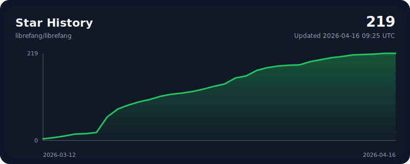

<p align="center">
  
</p>

<h1 align="center">LibreFang</h1>
<h3 align="center">自由的 Agent 操作系统 — Libre 意味着自由</h3>

<p align="center">
  使用 Rust 构建的开源 Agent OS。14 个 crate。2,100+ 测试。零 clippy 警告。
</p>

<p align="center">
  <a href="../README.md">English</a> | <a href="README.zh.md">中文</a> | <a href="README.ja.md">日本語</a> | <a href="README.ko.md">한국어</a> | <a href="README.es.md">Español</a> | <a href="README.de.md">Deutsch</a> | <a href="README.pl.md">Polski</a>
</p>

<p align="center">
  <a href="https://librefang.ai/">网站</a> &bull;
  <a href="https://docs.librefang.ai">文档</a> &bull;
  <a href="../CONTRIBUTING.md">贡献</a> &bull;
  <a href="https://discord.gg/DzTYqAZZmc">Discord</a>
</p>

<p align="center">
  <a href="https://github.com/librefang/librefang/actions/workflows/ci.yml"></a>
  
  
  
  
  <a href="https://discord.gg/DzTYqAZZmc"></a>
  <a href="https://deepwiki.com/librefang/librefang"></a>
</p>

---

### fork 版本说明

本 fork 版本与原版保持一致，少数不同的实现列在下面：
- 通过 LIBREFANG_USER_AGENT 来使用自定义的user-agent请求头。
- 缺省使用极小编译配置
- 禁止了Agent对 manifest 文件的修改。
- 取消了对 Hand 对话的过滤。
---

## 什么是 LibreFang？

LibreFang 是一个 **Agent 操作系统** — 用 Rust 从头构建的完整自主 AI 智能体运行平台。不是聊天机器人框架，不是 Python 包装器。

传统智能体框架等待你的输入。LibreFang 运行**为你工作的智能体** — 按计划全天候运行，监控目标、生成线索、管理社交媒体，并向控制台报告。

> LibreFang 是 [`RightNow-AI/openfang`](https://github.com/RightNow-AI/openfang) 的社区分支，采用开放治理和合并优先的 PR 政策。详见 [GOVERNANCE.md](../GOVERNANCE.md)。

<p align="center">
  
</p>

## 快速开始

```bash
# 安装 (Linux/macOS/WSL)
curl -fsSL https://librefang.ai/install.sh | sh

# 或通过 Cargo 安装
cargo install --git https://github.com/librefang/librefang librefang-cli

# 初始化（引导你完成服务商配置）
librefang init

# 启动 — 控制台 http://localhost:4545
librefang start
```

<details>
<summary><strong>Homebrew</strong></summary>

```bash
brew tap librefang/tap
brew install librefang              # CLI (stable)
brew install --cask librefang       # Desktop (stable)
# Beta/RC channels also available:
# brew install librefang-beta       # or librefang-rc
# brew install --cask librefang-rc  # or librefang-beta
```

</details>

<details>
<summary><strong>Docker</strong></summary>

```bash
docker run -p 4545:4545 ghcr.io/librefang/librefang
```

</details>

<details>
<summary><strong>云部署</strong></summary>

[](https://deploy.librefang.ai) [](https://deploy.librefang.ai) [](https://render.com/deploy?repo=https://github.com/librefang/librefang) [](https://railway.app/template/librefang) [](../deploy/gcp/README.md)

</details>

## Hands：为你工作的智能体

**Hands** 是预置的自主能力包，按计划独立运行，无需提示。内置 14 个：

| Hand | 功能 |
|------|------|
| **Researcher** | 深度研究 — 多源交叉引用、CRAAP 可信度评估、带引用的报告 |
| **Collector** | OSINT 监控 — 变化检测、情感追踪、知识图谱 |
| **Predictor** | 超级预测 — 带置信区间的校准预测 |
| **Strategist** | 战略分析 — 市场研究、竞争情报、商业规划 |
| **Analytics** | 数据分析 — 数据采集、分析、可视化、自动报告 |
| **Trader** | 市场情报 — 多信号分析、风险管理、投资组合分析 |
| **Lead** | 潜客发现 — 网络研究、评分、去重、合格线索交付 |
| **Twitter** | 自主 X/Twitter — 内容创作、定时发布、审批队列 |
| **Reddit** | Reddit 管理 — 子版块监控、发帖、互动追踪 |
| **LinkedIn** | LinkedIn 管理 — 内容创作、社交拓展、职业互动 |
| **Clip** | YouTube 转短视频 — 裁剪精华、字幕、AI 配音 |
| **Browser** | Web 自动化 — 基于 Playwright，购买操作强制审批 |
| **API Tester** | API 测试 — 端点发现、验证、负载测试、回归检测 |
| **DevOps** | DevOps 自动化 — CI/CD、基础设施监控、事件响应 |

```bash
librefang hand activate researcher   # 立即开始工作
librefang hand status researcher     # 查看进度
librefang hand list                  # 查看所有 Hands
```

自定义 Hand：定义 `HAND.toml` + 系统提示词 + `SKILL.md`。[指南](https://docs.librefang.ai/agent/skills)

## 架构

14 个 Rust crate，模块化内核设计。

```
librefang-kernel      编排、工作流、计量、RBAC、调度、预算
librefang-runtime     智能体循环、3 个 LLM 驱动器、53 个工具、WASM 沙箱、MCP、A2A
librefang-api         140+ REST/WS/SSE 端点、OpenAI 兼容 API、控制台
librefang-channels    40 个消息适配器，速率限制、DM/群组策略
librefang-memory      SQLite 持久化、向量嵌入、会话、压缩
librefang-types       核心类型、污点追踪、Ed25519 签名、模型目录
librefang-skills      60 个内置技能、SKILL.md 解析器、FangHub 市场
librefang-hands       14 个自主 Hands、HAND.toml 解析器、生命周期管理
librefang-extensions  25 个 MCP 模板、AES-256-GCM 保险库、OAuth2 PKCE
librefang-wire        OFP P2P 协议、HMAC-SHA256 双向认证
librefang-cli         CLI、守护进程管理、TUI 控制台、MCP 服务器模式
librefang-desktop     Tauri 2.0 原生应用（托盘、通知、快捷键）
librefang-migrate     OpenClaw、LangChain、AutoGPT 迁移引擎
xtask                 构建自动化
```

## 核心特性

**40 个渠道适配器** — Telegram、Discord、Slack、WhatsApp、Signal、Matrix、Email、Teams、Google Chat、飞书、LINE、Mastodon、Bluesky 等。[完整列表](https://docs.librefang.ai/integrations/channels)

**27 个 LLM 服务商** — Anthropic、Gemini、OpenAI、Groq、DeepSeek、OpenRouter、Ollama 等。智能路由、自动回退、成本追踪。[详情](https://docs.librefang.ai/configuration/providers)

**16 层安全体系** — WASM 沙箱、Merkle 审计链、污点追踪、Ed25519 签名、SSRF 防护、密钥清零等。[详情](https://docs.librefang.ai/getting-started/comparison#16-security-systems--defense-in-depth)

**OpenAI 兼容 API** — 即插即用的 `/v1/chat/completions` 端点。140+ REST/WS/SSE 端点。[API 参考](https://docs.librefang.ai/integrations/api)

**客户端 SDK** — 完整 REST 客户端，支持流式传输。

```javascript
// JavaScript/TypeScript
npm install @librefang/sdk
const { LibreFang } = require("@librefang/sdk");
const client = new LibreFang("http://localhost:4545");
const agent = await client.agents.create({ template: "assistant" });
const reply = await client.agents.message(agent.id, "Hello!");
```

```python
# Python
pip install librefang
from librefang import Client
client = Client("http://localhost:4545")
agent = client.agents.create(template="assistant")
reply = client.agents.message(agent["id"], "Hello!")
```

```rust
// Rust
cargo add librefang
use librefang::LibreFang;
let client = LibreFang::new("http://localhost:4545");
let agent = client.agents().create(CreateAgentRequest { template: Some("assistant".into()), .. }).await?;
```

```go
// Go
go get github.com/librefang/librefang/sdk/go
import "github.com/librefang/librefang/sdk/go"
client := librefang.New("http://localhost:4545")
agent, _ := client.Agents.Create(map[string]interface{}{"template": "assistant"})
```

**MCP 支持** — 内置 MCP 客户端和服务器。连接 IDE、扩展自定义工具、组合智能体管道。[详情](https://docs.librefang.ai/integrations/mcp-a2a)

**A2A 协议** — 支持 Google Agent-to-Agent 协议。跨智能体系统发现、通信和任务委派。[详情](https://docs.librefang.ai/integrations/mcp-a2a)

**桌面应用** — Tauri 2.0 原生应用，支持系统托盘、通知和全局快捷键。

**OpenClaw 迁移** — `librefang migrate --from openclaw` 导入智能体、历史、技能和配置。

## 开发

```bash
cargo build --workspace --lib                            # 构建
cargo test --workspace                                   # 2,100+ 测试
cargo clippy --workspace --all-targets -- -D warnings    # 零警告
cargo fmt --all -- --check                               # 格式化检查
```

## 对比

查看 [对比](https://docs.librefang.ai/getting-started/comparison#16-security-systems--defense-in-depth) 了解 LibreFang 与 OpenClaw、ZeroClaw、CrewAI、AutoGen、LangGraph 的基准测试和功能对比。

## 链接

- [文档](https://docs.librefang.ai) &bull; [API 参考](https://docs.librefang.ai/integrations/api) &bull; [入门指南](https://docs.librefang.ai/getting-started) &bull; [故障排除](https://docs.librefang.ai/operations/troubleshooting)
- [贡献](../CONTRIBUTING.md) &bull; [治理](../GOVERNANCE.md) &bull; [安全](../SECURITY.md)
- 讨论: [问答](https://github.com/librefang/librefang/discussions/categories/q-a) &bull; [用例展示](https://github.com/librefang/librefang/discussions/categories/show-and-tell) &bull; [功能投票](https://github.com/librefang/librefang/discussions/categories/ideas) &bull; [公告](https://github.com/librefang/librefang/discussions/categories/announcements) &bull; [Discord](https://discord.gg/DzTYqAZZmc)

## 贡献者

<a href="https://github.com/librefang/librefang/graphs/contributors">
  
</a>

<p align="center">
  我们欢迎各种形式的贡献 — 代码、文档、翻译、Bug 报告。<br/>
  查看 <a href="../CONTRIBUTING.md">贡献指南</a>，从一个 <a href="https://github.com/librefang/librefang/issues?q=is%3Aissue+is%3Aopen+label%3A%22good+first+issue%22">good first issue</a> 开始吧！<br/>
  您也可以访问 <a href="https://leszek3737.github.io/librefang-WIki/">非官方 wiki</a>，其中更新了面向新贡献者的有用信息。
</p>

<p align="center">
  <a href="https://github.com/librefang/librefang/stargazers">
    
  </a>
</p>

---

<p align="center">MIT 许可证</p>
